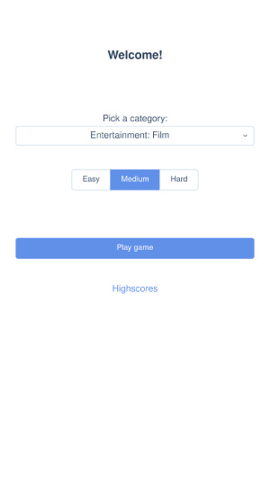
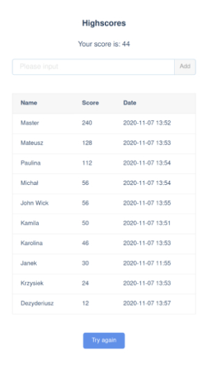
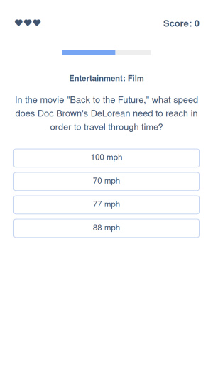
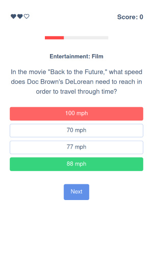

# Vue quiz app

Trivia game powered by Open Trivia DB connected with firebase.

## Features:

* 23 question categories

* Firebase connection for store highscores table

* Over 3,200 questions from [Open Trivia DB](https://opentdb.com/).


home           |  endgame
:-------------------------:|:-------------------------:
  |  

question           |  question answered
:-------------------------:|:-------------------------:
  |  

## Build with

 * [Vue.js](https://vuejs.org/)
 * [Open Trivia DB](https://opentdb.com/)
 * [AT-UI](https://at-ui.github.io/at-ui/#/en)

## Project setup
```
yarn install
```

### Compiles and hot-reloads for development
```
yarn serve
```

### Compiles and minifies for production
```
yarn build
```

### Customize configuration
See [Configuration Reference](https://cli.vuejs.org/config/).